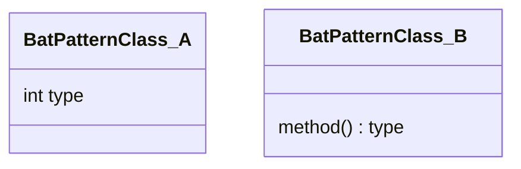
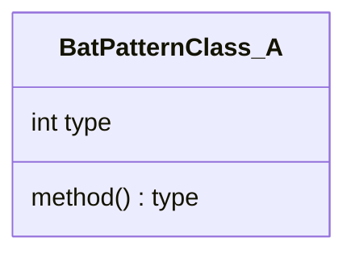
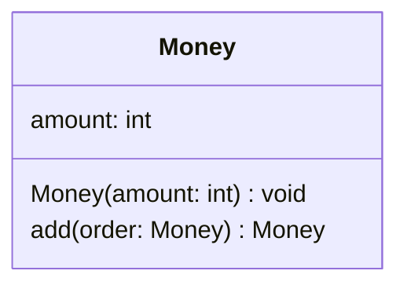

## 構成要素
- インスタンス変数
- メソッド

## methodの役割の明確化
### bat pattern

```mermaid
classDiagram
class BatPatternClass_A{
    int type
}
class BatPatternClass_B{
    method() type
}

```
### good

```mermaid
classDiagram
class BatPatternClass_A{
    int type
    method() type
}

```

### Money.phpで実装したクラス

```mermaid
classDiagram
class Money {
    amount: int
    Money(amount: int)void
    add(order: Money)Money
}

```