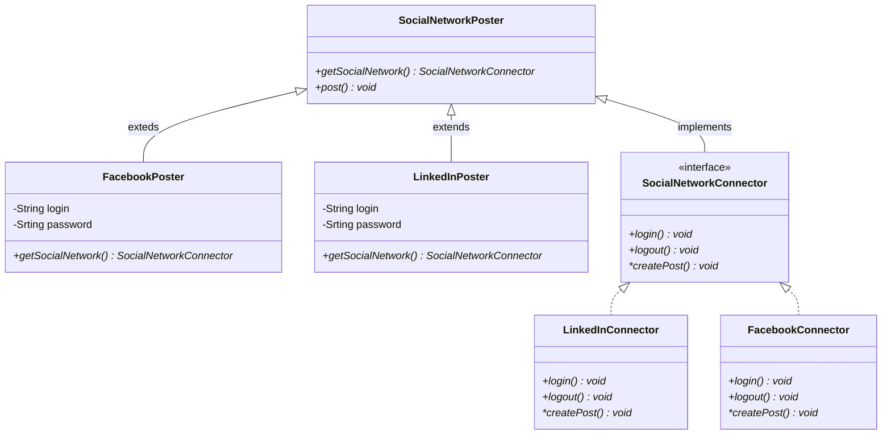

# ソーシャルログイン機能をFactoryMethod Methodパターンで実装

### Class図

factoryパターンとfactory　methodパターンは別のデザインパターン。混合している説明が多いため差がわかるように説明を追加。

factoryパターンではオブジェクトの生成と利用を分離し、利用側はオブジェクトの生成順や種類を知らなくてもオブジェクトの生成が可能になる。
それだけでは条件分岐が増えてしまい、バグが生まれやすいコードとなってしまう。

### SocialNetworkPoster
抽象化されたfactory。この抽象クラスのサブクラスでfactoryの実装を行う。
- `FacebookPoster`
- `LinkedInPoster`

### SocialNetworkPosterのサブクラス
factory methodパターンでは生成するオブジェクトの条件分岐をなくすことが目的。
`LinkedInPoster`と`FacebookPoster`のgetSocialNetworkではインスタンス化するクラスを目的に応じたクラスにすることで、facotyクラス内での条件分岐をなくすことができる。


### SocialNetworkConnector
factoryクラスから生成される物のインターフェース。

### SocialNetworkConnectorのサブクラス
ソーシャルログインに必要な機能を実装するクラス。
logIn() = ログインAPI
logOut() = ログアウトAPI
createPost() = ユーザー作成API
`FacebookConnector`と`LinkedInConnector`では呼び出すAPIが異なる。

### 実装
clientCodeではSocialNetworkPosterのサブクラスを渡すことで、任意のソーシャルログインが行える。
```
function clientCode(SocialNetworkPoster $creator)
{
    $creator->post("Hello world!");
    $creator->post("I had a large hamburger this morning!");
}

clientCode(new FacebookPoster("john_smith", "******"));
clientCode(new LinkedInPoster("john_smith@example.com", "******"));
```